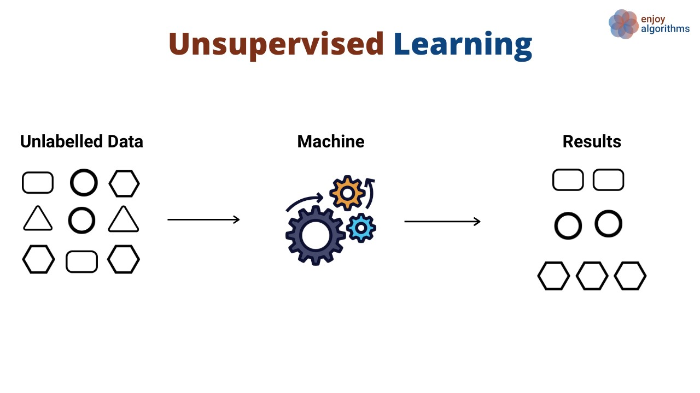
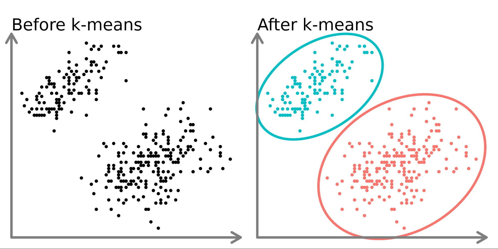
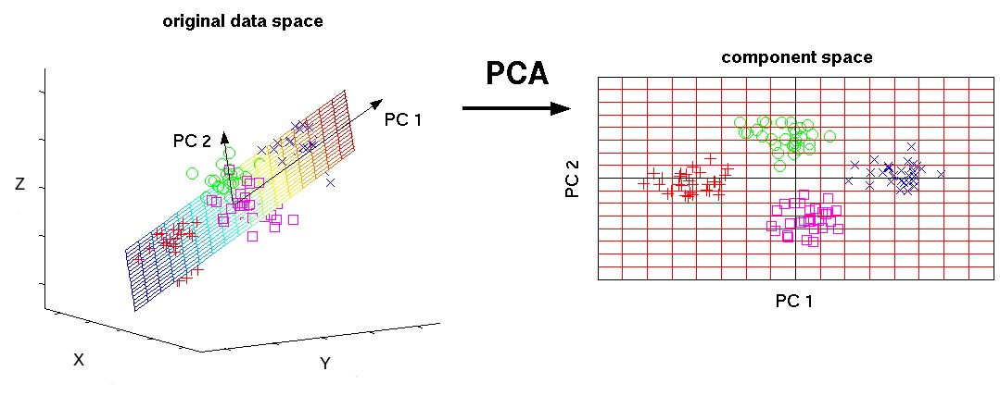

# CryptoClustering Project

In this project, I use Python and unsupervised learning techniques to cluster cryptocurrencies and analyze if they are affected by 24-hour or 7-day price changes.

## Project Structure
This project consists of a Jupyter notebook, `Crypto_Clustering.ipynb`, and a dataset, `crypto_market_data.csv`, containing cryptocurrency market data. I used the data to apply clustering and dimensionality reduction techniques and then visualize the results.

## Requirements Technologies
- `pandas`
- `hvplot`
- `scikit-learn`

## Instructions

### Step 1: Load and Explore the Data
1. After loading `crypto_market_data.csv` file into a DataFrame, I
2. Display summary statistics and plot the data to understand its structure.

### Step 2: Data Preparation
1. I used `StandardScaler` to normalize the data.
2. Created a DataFrame with the scaled data, setting the `coin_id` column as the index.

### Step 3: Finding the Best Value for k (Using the Scaled DataFrame)
1. I used the elbow method to find the optimal value of `k` for clustering.
2. Then Plotted inertia values for k values from 1 to 11, and
3. identified the best `k` value based on the elbow curve.

### Step 4: Cluster Cryptocurrencies with K-means
1. I initialized the K-means model using the best value for `k`.
2. Then Fitted and predict clusters for the scaled DataFrame and add a new column with predicted cluster labels to the DataFrame; then
4. Used `hvPlot` to create a scatter plot to visualize clusters.

### Step 5: Optimize Clusters with PCA
1. I used PCA on the scaled DataFrame to reduce features to three principal components, then
3. Created a new DataFrame with the PCA data, setting `coin_id` as the index.

### Step 6: Find the Best k for the PCA DataFrame
1. I used the elbow method to determine the best `k` using the PCA data, then
2. Plotted inertia values for k values from 1 to 11 and compared the optimal `k` value found here with the original data’s optimal `k`.

### Step 7: Cluster Cryptocurrencies Using the PCA Data
1. After, I initialized, fitted, and predicted clusters using K-means on the PCA data, and
2. Added cluster labels to the PCA DataFrame and created a scatter plot to visualize.

### Step 8: Composite Plots and Analysis
1. Created a composite plot comparing the elbow curves from the original and PCA data, then
2. Created a composite plot comparing clusters from the original and PCA data.

## Conclusion
This project explores clustering and dimensionality reduction using K-means and PCA, providing insights into cryptocurrency market behaviors based on daily and weekly price changes.

